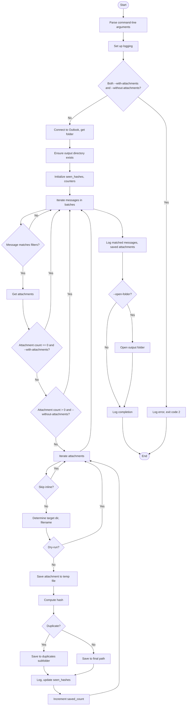

## Outlook Attachments Export Tool – Main Control Flow (Pseudocode)

### Pseudocode

1. **Parse Command-Line Arguments**
	- Define and parse arguments for output directory, date range, sender(s), subject/body keywords, attachment presence/absence, folder path, limit, batch size, dry-run, open-folder, log file, verbosity, etc.
	- Store parsed arguments in `args`.

2. **Set Up Logging**
	- Determine log level based on verbosity/quiet flags.
	- Configure logging handlers (console, optional file).
	- Set log format.

3. **Main Execution**
	- Log start message.
	- If both `--with-attachments` and `--without-attachments` are set:
		- Log error and exit with code 2.

	- **Try:**
		1. **Process Messages**
			- Connect to Outlook via COM.
			- Get Outlook namespace.
			- Get target folder (default Inbox or traverse custom path).
			- Ensure output directory exists.
			- Initialize `seen_hashes`, `saved_count`, `matched_messages`.
			- **Iterate Messages in Batches:**
				- For each batch of messages:
					- For each message:
						- **Filter Message:**
							- Check date range, sender, subject/body keywords, attachment presence/absence.
							- If not matching, continue.
						- Increment `matched_messages`.
						- Get attachments collection.
						- If no attachments and `--with-attachments`, continue.
						- If attachments exist and `--without-attachments`, continue.
						- **Iterate Attachments:**
							- For each attachment:
								- Skip inline unless requested.
								- Determine target directory (sanitize, truncate, fallback if needed).
								- Determine filename (sanitize, truncate).
								- If dry-run: log intended save path, continue.
								- Save attachment to temp file (handle errors).
								- Compute hash of temp file.
								- **Duplicate Detection:**
									- If hash seen before: save to duplicates subfolder, log, update `seen_hashes`.
									- Else: save to final path, log, update `seen_hashes`.
								- Increment `saved_count` if saved.
			- Log number of matched messages and saved attachments.
			- Return `saved_count`.

		2. **If `--open-folder` is set:**
			- Try to open output folder in file explorer (handle errors).

		3. Log completion and number of saved attachments.
		4. Exit with code 0.

	- **Except Exception:**
		- Log unhandled error with traceback.
		- Exit with code 1.

4. **END PROGRAM**

---

### Mermaid Flowchart

